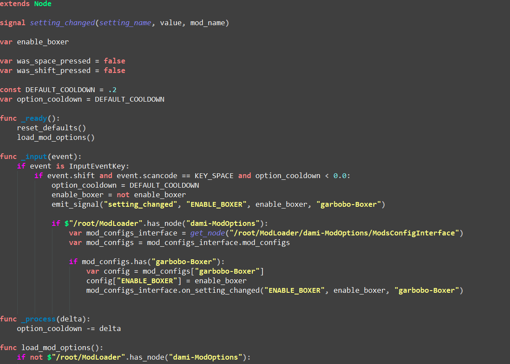

# GodotScript4Notepadplusplus
A user defined language in Notepad++ for Godot Script, updated as of Godot 4. Right now it lacks the feature for folding code/comments (not sure how to do this with gd script as it uses indentation rather than delimiters for code blocks). Contains highlighting for keywords, annotations, comments, and globally defined functions. Two versions available, one for when using Npp light themes, one for dark themes, as shown below.

### Light theme (GodotScript4.xml):

### Dark theme (GodotScript4_dark.xml):

## Installation
Two ways:
1. Store .xml file(s) in the user defined languages folder (e.g., ...\AppData\Roaming\Notepad++\userDefineLangs)
2. Import via menu Languages > User Defined Languages > Define your language... > [Import button] and select .xml file

The imported languages will be selectable at the bottom of the *Language* menu (not stored in the alphabetical submenus).

## Notes
Light/dark themes for Npp can be managed in Settings > Style Configurator. GodotScript4_dark.xml was developed using background color defined by Hue: 160, Sat: 0, Lum: 59, Red: 63, Green: 63, Blue: 63. However, all backgrounds in GodotScript4_dark.xml are set to transparent, so any dark color, including plain old black, should work.
